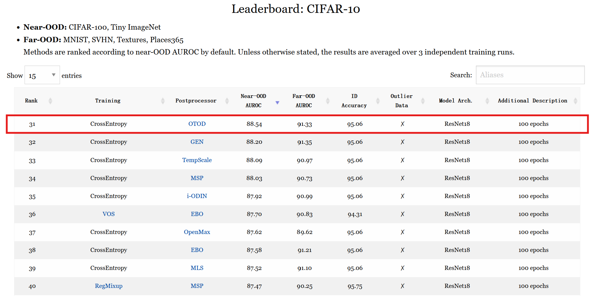
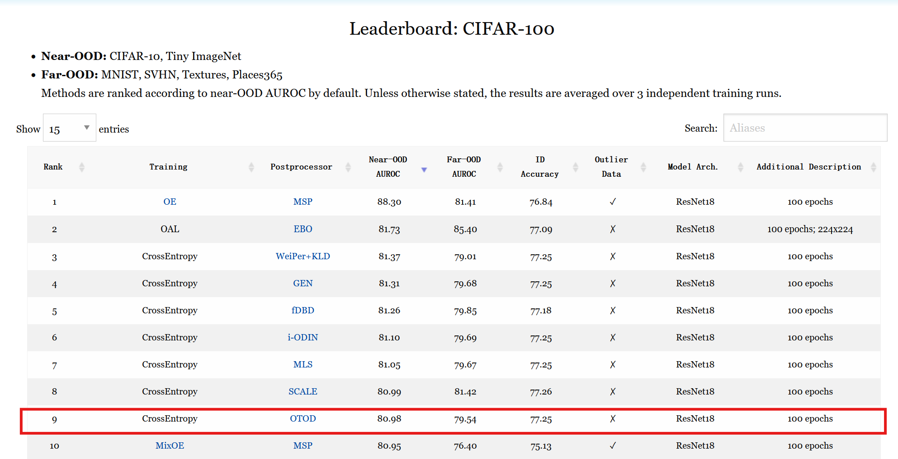

# Detecting OOD Samples via Optimal Transport Scoring Function

> Heng Gao, Zhuolin He, Jian Pu*  
> Fudan University

Before using our code, please first install the [OpenOOD](https://github.com/Jingkang50/OpenOOD). The pre-trained models are available [here](https://drive.google.com/drive/folders/1XSVB8pyYWuMVpq7BTuIESfU8GvCumxOn?usp=sharing). All our experiments are conducted on one NVIDIA V100 GPU.

### Data Preparation

Our codebase accesses the datasets from `./data/`.

```
├── ...
├── data
│   ├── benchmark_imglist
│   ├── images_classic
├── openood
├── results
│   ├── checkpoints
│   └── ...
├── scripts
├── main.py
├── ...
```

### Usage

```sh
# CIFAR-100
bash scripts/ood/otd/cifar100_test_ood_otod.sh
# CIFAR-10
bash scripts/ood/otd/cifar10_test_ood_otod.sh
```

### Benchmark Results
  

  

## Citation
If you find **OTOD** useful in your research, please consider citing:
```
@INPROCEEDINGS{10890502,
  author={Gao, Heng and He, Zhuolin and Pu, Jian},
  booktitle={ICASSP 2025 - 2025 IEEE International Conference on Acoustics, Speech and Signal Processing (ICASSP)}, 
  title={Detecting OOD Samples via Optimal Transport Scoring Function}, 
  year={2025},
  volume={},
  number={},
  pages={1-5},
  keywords={Training;Machine learning;Predictive models;Benchmark testing;Signal processing;Probability;Feature extraction;Safety;Speech processing;Detection algorithms;Out-of-distribution detection;Wasserstein distances;Deep neural networks;Machine learning safety},
  doi={10.1109/ICASSP49660.2025.10890502}}
```
